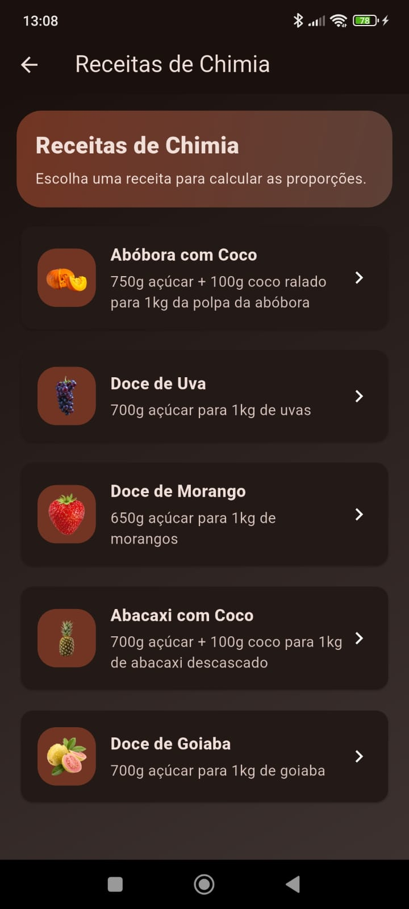
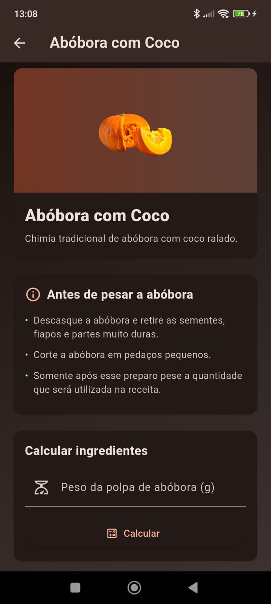
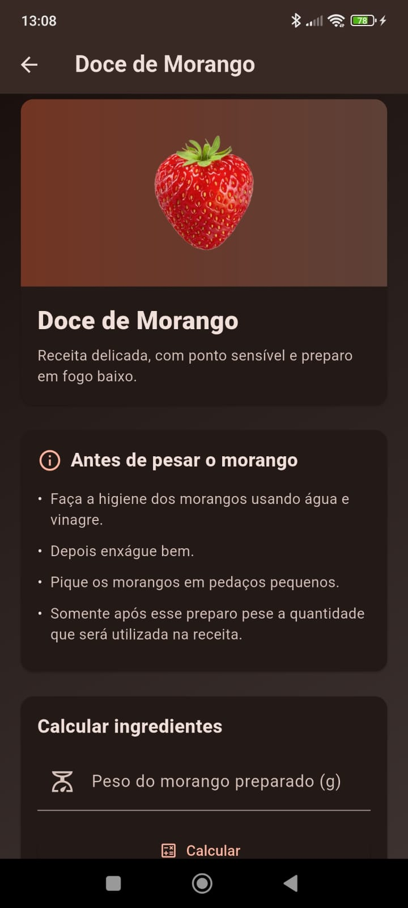
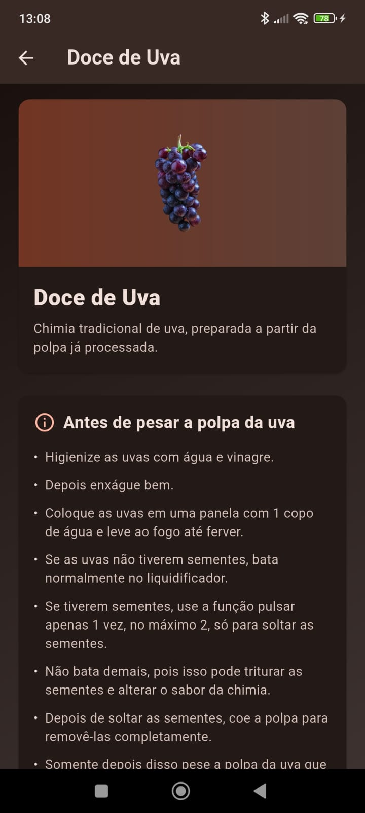
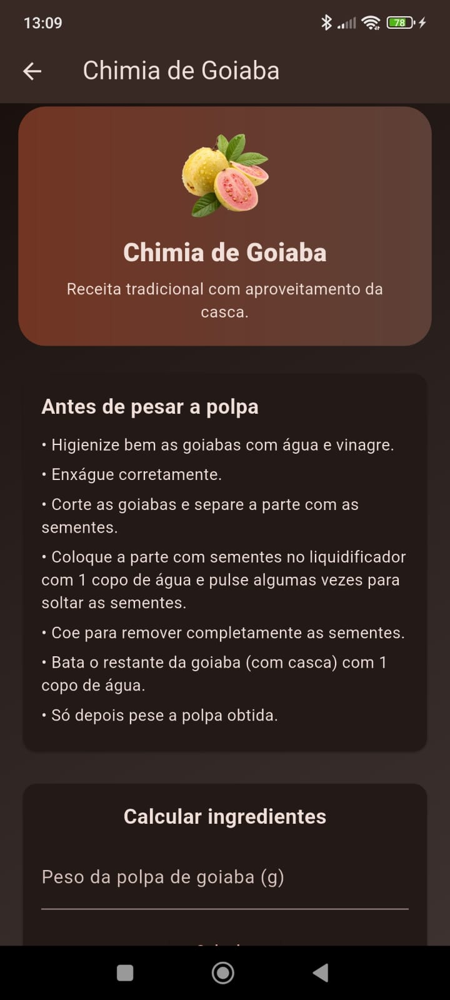
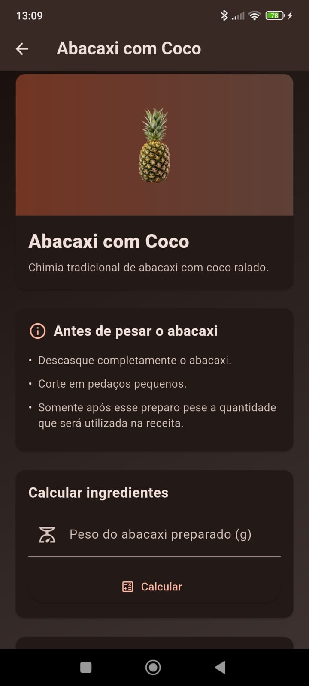

# 📖 Livro de Receitas – Chimias Artesanais

Aplicativo Flutter desenvolvido para cálculo e preparo de chimias artesanais, baseado em receitas reais e proporções por peso.

---

## ✨ Funcionalidades

- 📌 Cálculo automático de açúcar por peso da polpa
- 📊 Informação nutricional por 100g
- 🍓 Porção individual de 5g
- 🥄 Processo de preparo detalhado por receita
- 🎨 Interface moderna com identidade visual própria

---

## 📷 Screenshots

### 🏠 Menu Principal

### 🍯 Menu de Chimias

### 🎃 Abóbora com Coco

### 🍓 Chimia de Morango

### 🍇 Chimia de Uva

### 🥭 Chimia de Goiaba

### 🍍 Abacaxi com Coco

---

## 🛠 Tecnologias Utilizadas

- Flutter
- Dart
- Material Design

---

## 🚀 Objetivo

Projeto criado para estudo de Flutter, organização de layout e publicação futura na Google Play Store.
